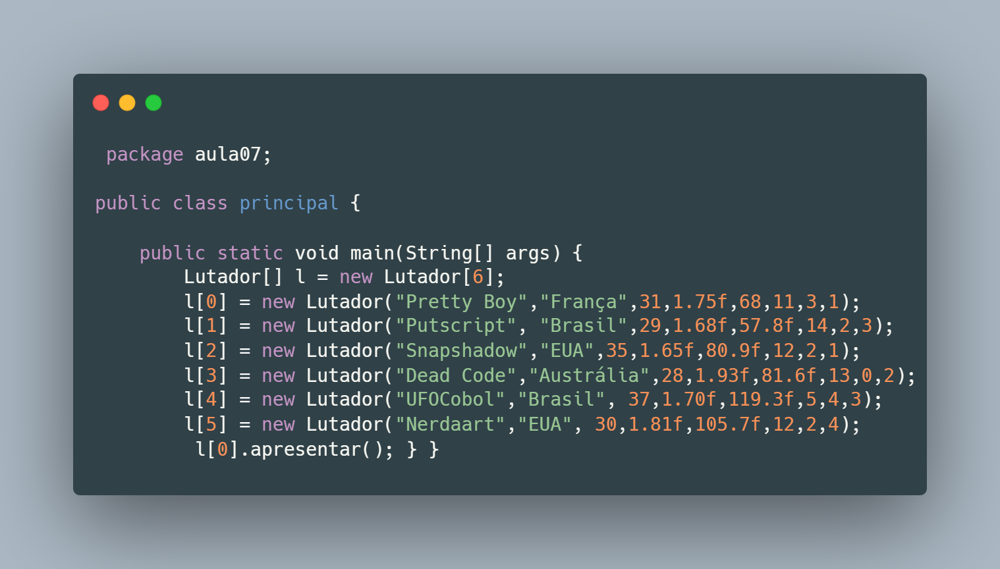
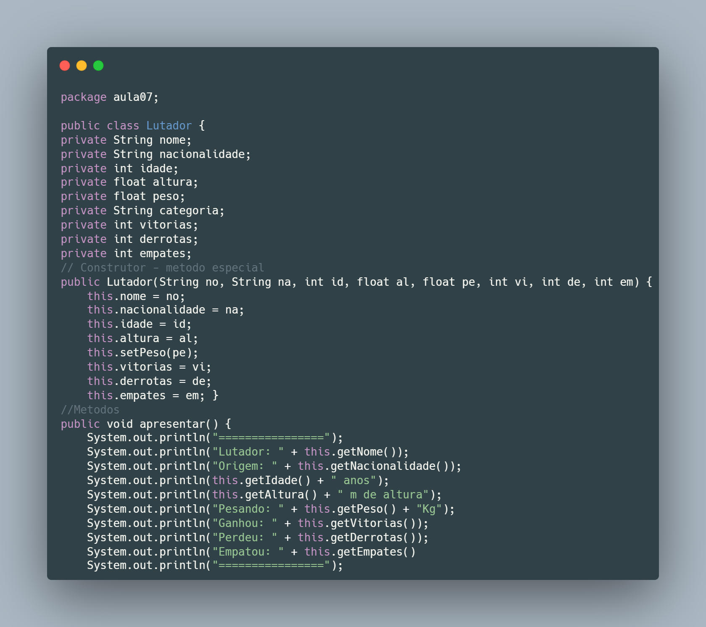
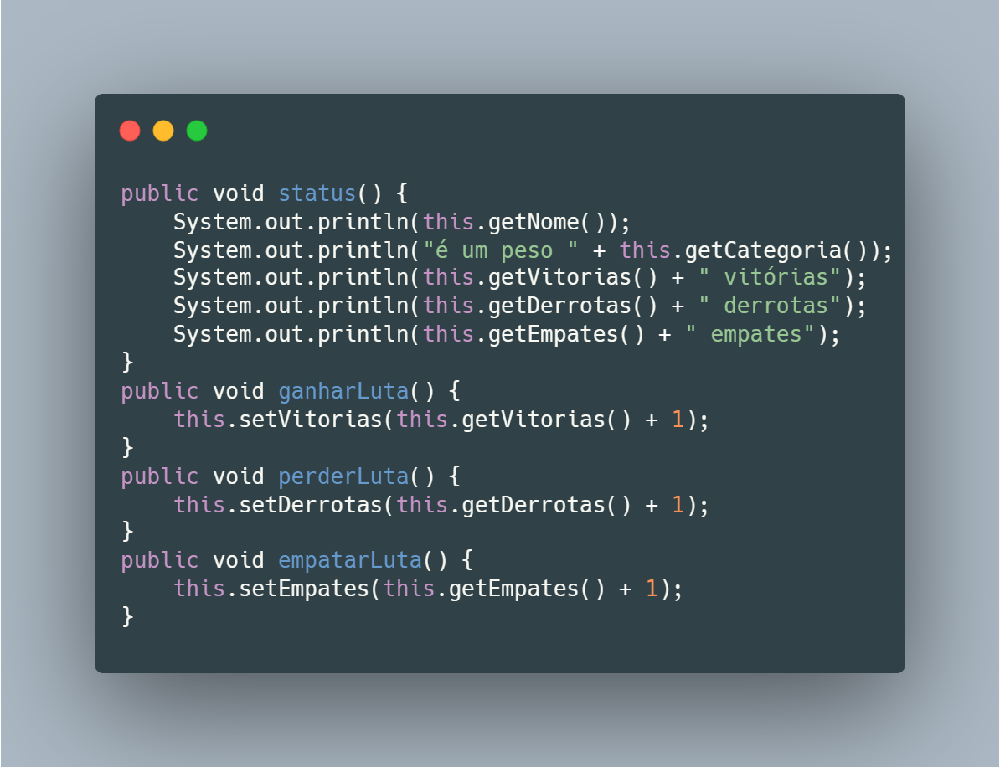
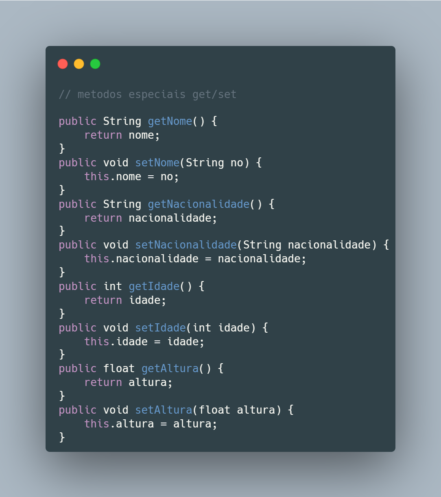
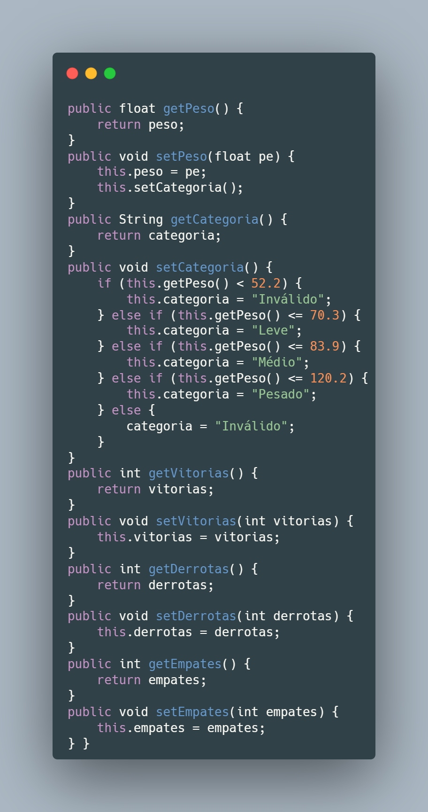
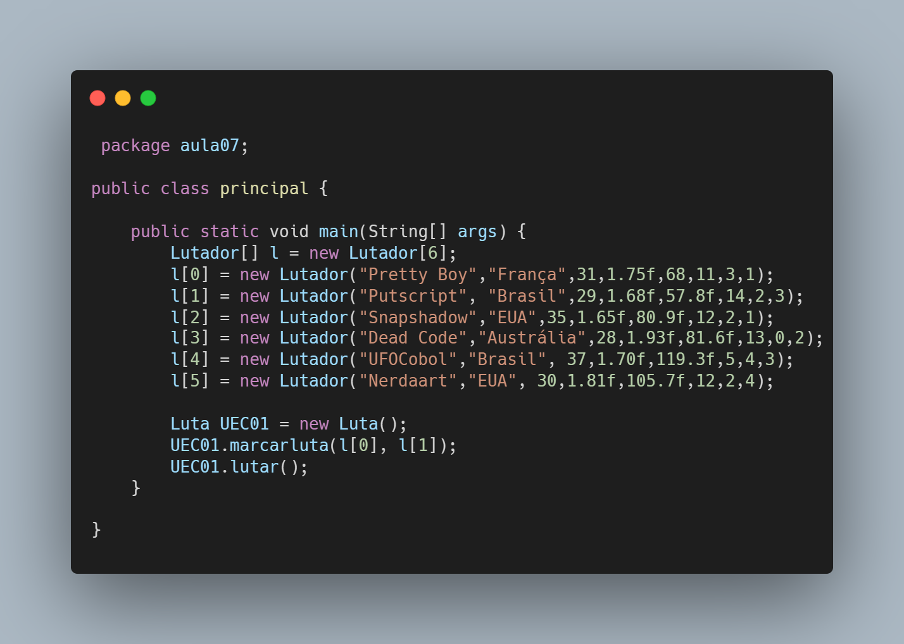
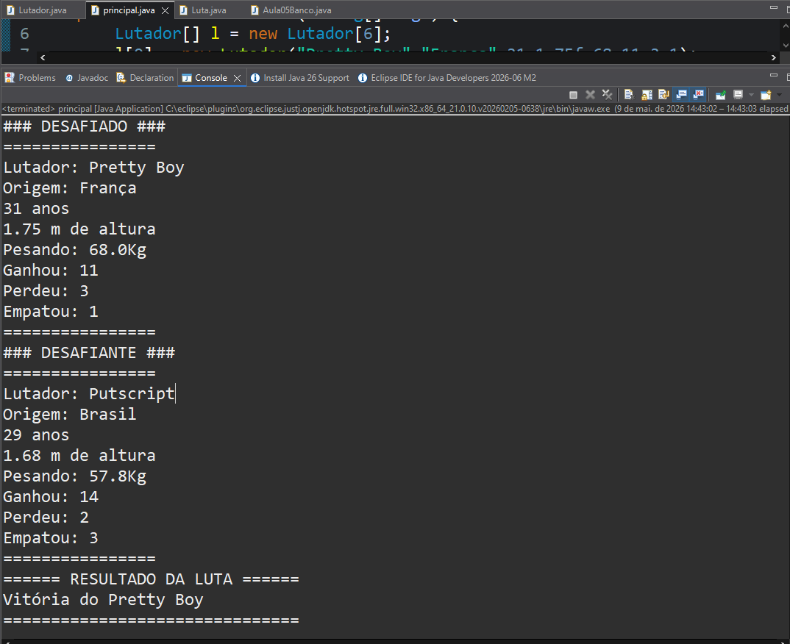

# UltraEmojiCombat-Gestão-de-Lutadores-Java-POO
Este projeto faz parte do módulo de Relacionamento entre Classes no estudo de Programação Orientada a Objetos. O objetivo aqui foi criar uma base sólida para um simulador de combates, focando na organização de múltiplos objetos e validações automáticas.

 # O que foi implementado?
Nesta etapa do projeto, explorei como lidar com múltiplos objetos e como as características de um objeto podem influenciar outras automaticamente.

Principais conceitos aplicados:
Array de Objetos: Utilização de Lutador[] para armazenar e gerenciar 6 competidores de forma indexada.

Encapsulamento: Todos os atributos estão protegidos (private) e são acedidos exclusivamente através de métodos Getter e Setter.

Lógica de Negócio Automática: O método setPeso() aciona internamente o setCategoria(), garantindo que um lutador nunca esteja numa categoria errada para o seu peso.

Métodos de Interface: Implementação de métodos como apresentar(), ganharLuta(), perderLuta() e empatarLuta().

---

# 📏 Regras de Categorização
O sistema classifica automaticamente o lutador com base no seu peso:

Leve: Entre 52.2 Kg e 70.3 Kg.

Médio: Entre 70.4 Kg e 83.9 Kg.

Pesado: Entre 84.0 Kg e 120.2 Kg.

Inválido: Pesos fora destas faixas desabilitam o lutador para competições.

---

# 📂 Estrutura de Ficheiros
Lutador.java: Classe que define os atributos e comportamentos de cada competidor.

principal.java: Classe de teste onde o Array de objetos é instanciado e as apresentações são chamadas.

---

