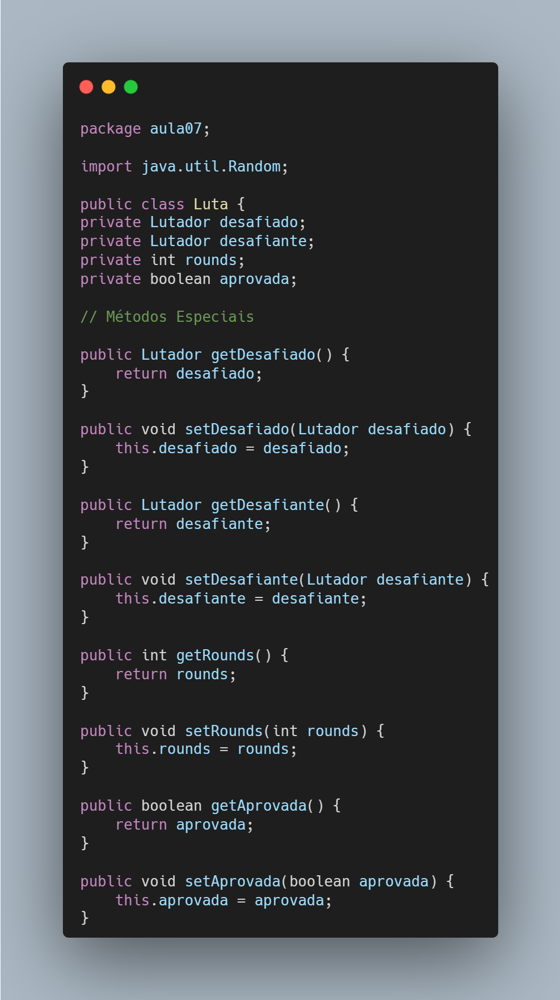
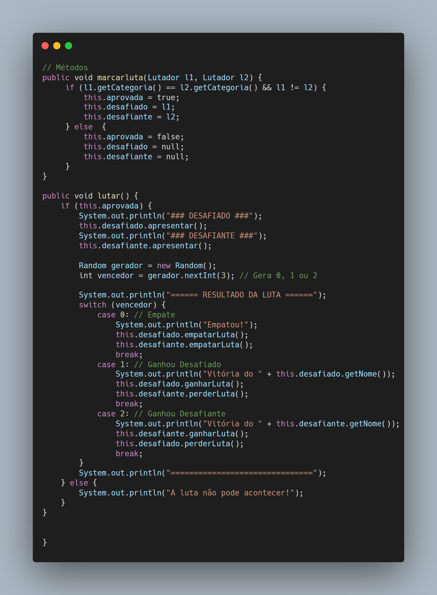

# 🥊 UltraEmojiCombat-Gestão-de-Lutadores-Java-POO
Este projeto faz parte do módulo de Relacionamento entre Classes no estudo de Programação Orientada a Objetos. O objetivo aqui foi criar uma base sólida para um simulador de combates, focando na organização de múltiplos objetos e validações automáticas.

 # O que foi implementado?
Nesta etapa do projeto, explorei como lidar com múltiplos objetos e como as características de um objeto podem influenciar outras automaticamente.

Principais conceitos aplicados:

🔖 Array de Objetos: Utilização de Lutador[] para armazenar e gerenciar 6 competidores de forma indexada.

🔖 Encapsulamento: Todos os atributos estão protegidos (private) e são acedidos exclusivamente através de métodos Getter e Setter.

🔖 Lógica de Negócio Automática: O método setPeso() aciona internamente o setCategoria(), garantindo que um lutador nunca esteja numa categoria errada para o seu peso.

🔖 Métodos de Interface: Implementação de métodos como apresentar(), ganharLuta(), perderLuta() e empatarLuta().

🔖 Agregação (Has-a): A classe Luta possui atributos do tipo Lutador. Isso demonstra como objetos independentes podem ser agrupados para formar uma funcionalidade complexa.

🔖 Regras de Negócio para Combate: Implementação de lógica para validar se uma luta pode ocorrer (mesma categoria e lutadores diferentes).

🔖 Geração Aleatória: Uso da classe java.util.Random para simular o resultado imprevisível de um confronto.

🔖 Atualização de Estado Inter-Classes: O resultado processado na classe Luta altera automaticamente as estatísticas (vitórias, derrotas, empates) dentro dos objetos da classe Lutador.

---

# ⚙️ Regras do Combate
Para que o espetáculo aconteça, o sistema segue estas condições:

Aprovação: A luta só é aprovada se o desafiado e o desafiante pertencerem à mesma categoria de peso.

Identidade: Um lutador não pode lutar contra si mesmo.

Resultado: O vencedor é definido aleatoriamente, podendo resultar em:

Empate: Ambos os lutadores ganham +1 no histórico de empates.

Vitória do Desafiado: Desafiado ganha +1 vitória / Desafiante ganha +1 derrota.

Vitória do Desafiante: Desafiante ganha +1 vitória / Desafiado ganha +1 derrota.

---

# 📏 Regras de Categorização
O sistema classifica automaticamente o lutador com base no seu peso:

Leve: Entre 52.2 Kg e 70.3 Kg.

Médio: Entre 70.4 Kg e 83.9 Kg.

Pesado: Entre 84.0 Kg e 120.2 Kg.

Inválido: Pesos fora destas faixas desabilitam o lutador para competições.

---

# 📂 Estrutura de Ficheiros
Lutador.java: Classe que define os atributos e comportamentos de cada competidor.

principal.java: Classe de teste onde o Array de objetos é instanciado e as apresentações são chamadas.

Luta.java: Classe responsável por gerenciar a agregação, validar e processar os combates.

---

Estudos focados em Programação Orientada a Objetos com Java.

---

  
📸 Clique aqui para ver os prints do código

  
  
  
  
  
  
  
  
  
  

